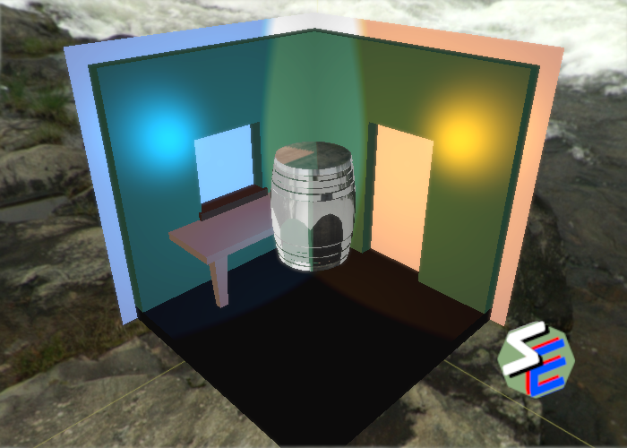

# SckzEngine

#### A Vulkan games engine by Sckzor

All Code in this library is (c) Sckzor 2021, All rights reserved!

## Goals for the engine

1. Learn to write extremely high performance code
2. Learn to implement advanced graphics features
3. Make a game that is fun to play

## Timeline for the game

- June '21 - Have the basic engine working including more advanced lighting and animation

  - April 30, '21 - FBOs / Swapchain
  - May 31, '21 - Memory Manager / GUIs / Particles
  - June 31, '21 - Animation / More Lighting

- September '21 - Have a prototype for the game functioning, continue adding to the engine

- January '22 - Have the game finished and on Steam for others to enjoy

## Progress on the engine

### 1st Priority

- [x] Basic Vulkan creation and initialization.
- [x] Proper makefile.
- [x] Basic destruction and memory leak prevention.
- [x] Change the "pipeline" class to "graphics pipeline" class and make the pipeline swapable.
- [x] Multiple Object Rendering.
- [x] Memory management.
- [x] The ability to move, scale and rotate objects at will instead of having them just spin as well as adding a camera class.
- [x] Add a render function that allows the scene to be rendered from multiple cameras without having the time advance.
- [x] Simple Lighting.
- [x] Batched Rendering.
- [x] Add sub-allocated buffers.
- [ ] FBO filters.
- [x] Add an options for on-demand changes to the swap chain like locked refresh rate and stuff like that.
- [ ] Particles.
- [ ] Finish the _vulkan_ memory manager.
- [ ] Optimize, Optimize, Optimize.
- [ ] Simple GUIs.
- [ ] Advanced Lighting.
- [ ] Animation.
- [ ] Optimize, Optimize, Optimize.
- [ ] Add custom _system_ memory managment
- [ ] Add custom dynamic _system_ memory structures

### 2nd Priority

- [ ] Networking support.
- [ ] Ray Tracing.
- [ ] Video support for cut scenes and similar.
- [ ] Adding more classes... maybe. (perhaps this is a bad idea, don't add code you don't need?)
- [x] FORMATING!

### 3rd Priority

- [ ] DLSS support, if I can convince NVidia to give me the development materials.
- [ ] Support for other platorms.

## Known issues and bugs

- [ ] The sampler does not need to be recreated with every texture, one for all of the textures is fine.
- [ ] Some strange bug where if a time.deltatime call is made in the first iteration of the main while loop then the movement/ rotation of an object will just lockup and not move at all?
- [ ] Program breaks when the resolution becomes too large because the frame buffer gets bigger than the size of the memory blocks, I need to dynamically choose the size of the buffer based on the screen resolution.

## Build tools

- G++ is required to build the C++ code
- clang-format is needed to format all of the code that you might add
- Valgrind for leak checking the code

## Latest Valgrind results

```
==10130== LEAK SUMMARY:
==10130==    definitely lost: 55,600 bytes in 15 blocks
==10130==    indirectly lost: 21,967 bytes in 308 blocks
==10130==      possibly lost: 83,792 bytes in 2 blocks
==10130==    still reachable: 184,876 bytes in 2,306 blocks
==10130==         suppressed: 0 bytes in 0 blocks
==10130==
==10130== ERROR SUMMARY: 97 errors from 78 contexts (suppressed: 0 from 0)
```

I believe that all of the memory leak is caused by strage behavior of the Vulkan library... The errors though,
those were caused by me and I need to fix them at some point.

## Image of the Engine in action


